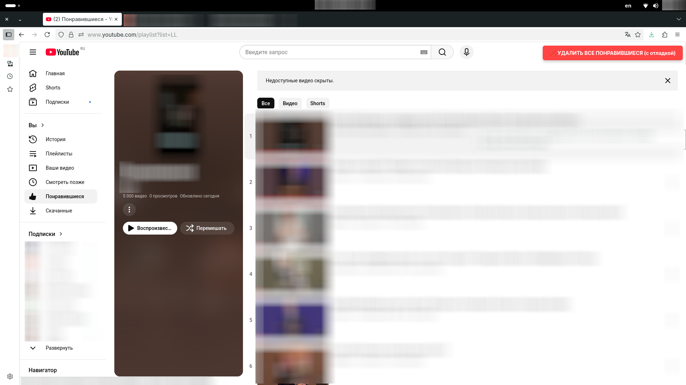

# 🗑️ YouTube Bulk Delete Liked Videos

> ⚠️ **ЮРИДИЧЕСКОЕ ПРЕДУПРЕЖДЕНИЕ**  
> Данный скрипт **НАРУШАЕТ Terms of Service YouTube** (раздел "Permissions and Restrictions"):  
> *"access the Service using any automated means (such as robots, botnets or scrapers) except [...] with YouTube's prior written permission"*  
> **Использование может привести к ПОЛНОЙ БЛОКИРОВКЕ вашего Google/Youtube аккаунта без предупреждения.**

Пользовательский скрипт для **образовательного изучения** DOM-автоматизации с примером удаления видео из "Понравившиеся".

> ❗ **ВАЖНО!**  
> Этот скрипт предназначен ТОЛЬКО для обучения! Никогда не используйте его на реальных аккаунтах.

## 🚀 Установка
1. Установите [Tampermonkey](https://www.tampermonkey.net/)
2. [**Нажмите для установки скрипта**](https://github.com/glprokhozhev/youtube-delete-liked-videos/raw/main/script.user.js)
3. Подтвердите установку во всплывающем окне Tampermonkey

## 🧪 Образовательное применение
Скрипт демонстрирует:
- Работу с DOM-элементами в реальном времени
- Обработку динамически загружаемого контента
- Поиск элементов через резервные селекторы
- Отладку пользовательских скриптов

**Для запуска в образовательных целях:**
1. Создайте **тестовый аккаунт YouTube** без важных данных
2. Перейдите на страницу: `https://www.youtube.com/playlist?list=LL`
3. Нажмите красную кнопку в правом верхнем углу
4. Анализируйте логи в консоли (F12 → Console)

## ⚠️ Юридический статус
- **Автор**: [@glprokhozhev](https://github.com/glprokhozhev)
- **Назначение**: Исключительно образовательное (изучение DOM-автоматизации)
- **Юридический статус**: Скрипт нарушает Terms of Service YouTube и не предназначен для использования на реальных аккаунтах
- **Ответственность**: Автор не несет ответственности за последствия использования скрипта

> 💡 **Рекомендация YouTube**  
> Для управления понравившимися видео используйте официальные методы:  
> - Ручное удаление через интерфейс YouTube
> - Официальный YouTube Data API для разработчиков (с соблюдением квот)

## 🤝 Вклад в проект
PR приветствуются для:
- Улучшения образовательной документации
- Добавления примеров безопасной автоматизации
- Обновления селекторов при изменении верстки YouTube

## 📜 Лицензия
MIT License © 2025 Gleb Prokhozhev

**ПРИМЕЧАНИЕ**: Эта лицензия распространяется только на код скрипта. Использование скрипта для взаимодействия с YouTube может нарушать их Terms of Service независимо от данной лицензии.
