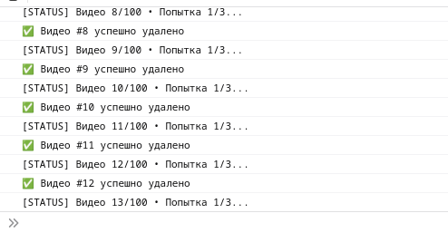

# 🗑️ YouTube Bulk Delete Liked Videos

Пользовательский скрипт для **массового удаления** видео из раздела "Понравившиеся" на YouTube с подробной отладкой в консоли.

> ⚠️ **ВАЖНО!**
> Удаление нельзя отменить! Перед использованием убедитесь, что вы на правильной странице:  
> `https://www.youtube.com/playlist?list=LL`

## 🚀 Установка
1. Установите [Tampermonkey](https://www.tampermonkey.net/)
2. [**Нажмите для установки скрипта**](https://github.com/ваш-аккаунт/youtube-delete-liked-videos/raw/main/script.user.js)
3. Подтвердите установку во всплывающем окне Tampermonkey

## 🛠 Как использовать
1. Перейдите в [Ваши понравившиеся видео](https://www.youtube.com/playlist?list=LL)
2. Дождитесь полной загрузки страницы
3. Нажмите красную кнопку **"❌ УДАЛИТЬ ВСЕ ПОНРАВИВШИЕСЯ (с отладкой)"** в правом верхнем углу
4. Следите за процессом в консоли разработчика (F12 → Console)

## ⚙️ Особенности
- Автоматическая прокрутка страницы для загрузки всех видео
- Поиск элементов через несколько резервных селекторов
- Поддержка русского и английского интерфейсов YouTube
- Отладочные сообщения для отслеживания процесса
- Защита от случайного запуска (работает только на странице LL-плейлиста)

## ❓ Если скрипт не работает
1. Обновите Tampermonkey до последней версии
2. Обновите скрипт через GitHub
3. Проверьте консоль разработчика (F12) на ошибки
4. Убедитесь, что YouTube не изменил верстку (создайте Issue)

## 🤝 Поддержка
PR приветствуются! Если YouTube обновил верстку:
1. Сделайте форк репозитория
2. Обновите селекторы в `script.user.js`
3. Отправьте Pull Request

4. ## ⚠️ Юридический статус
Данный скрипт был:
- Первоначально сгенерирован ИИ-ассистентом в образовательных целях
- Адаптирован, протестирован и доведён до рабочего состояния человеком
- Принят к публикации с полной ответственностью за последствия

**Я, [@glprokhozhev](https://github.com/glprokhozhev), подтверждаю, что:**
1. Понимаю логику работы всего кода
2. Тестирую скрипт на своём аккаунте
3. Беру на себя все риски при использовании
4. Соблюдаю [условия использования YouTube](https://www.youtube.com/t/terms)

## ⚠️ Предупреждение
Автор не несет ответственности за:
- Случайное удаление видео
- Блокировку аккаунта YouTube
- Изменения в API YouTube

**Рекомендуется проверить работу скрипта на тестовом аккаунте!**

---

© 2025 Gleb Prokhozhev • Лицензия [MIT](LICENSE)
